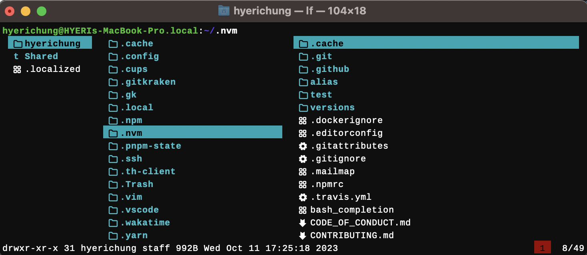

# Hyeri's setup





#### shell

- print all of shell
  - `cat /etc/shells`
- setup zsh as a default shell
  - `chsh -s /bin/zsh`
  - `echo $SHELL` -> `/bin/zsh`

#### homebrew

```
/bin/bash -c "$(curl -fsSL https://raw.githubusercontent.com/Homebrew/install/HEAD/install.sh)"
```

- `which brew` -> `/usr/local/bin/brew`

- path for formulae and casks installed through brew -> `/usr/local/bin`
  - e.g. `/usr/local/bin/git`
  - e.g. `Visual studio code`
    - `/Applications/Visual Studio Code.app`
    - `code` command -> `/usr/local/bin`

#### zsh

- [`$HOME/DEV_ROOT/sdk/zsh/.zshrc`](/DEV_ROOT/sdk/zsh/.zshrc)<br>
- #### plugins
  - `$HOME/DEV_ROOT/sdk/zsh/plugins`<br>
    - [fast-syntax-highlighting](https://github.com/zdharma-continuum/fast-syntax-highlighting)
    - [zsh-autosuggestions](https://github.com/zsh-users/zsh-autosuggestions)
    - [zsh-autocompletions](https://github.com/marlonrichert/zsh-autocomplete)
    - [zsh-you-should-use](https://github.com/MichaelAquilina/zsh-you-should-use)
- #### powerlevel10k

  - i don't want to use oh-my-zsh
  - `$HOME/DEV_ROOT/sdk/zsh/powerlevel10k`

    ```
      git clone --depth=1 https://github.com/romkatv/powerlevel10k.git ~/powerlevel10k
      echo 'source ~/powerlevel10k/powerlevel10k.zsh-theme' >> $ZSH/.zshrc
    ```

  - `p10k configure` -> `lean`

- #### font
  - [Cousine Nerd Font](https://www.nerdfonts.com/font-downloads)
    - download > double-click > add to `Font Book.app` > terminal > `Settings` > `Profiles` > change `Font` - `Cousine Nerd Font`

#### lf

- `~/.config/lf`
- `brew install lf` > GUI for file searching
- `brew install fd` > file searching for lf
- `brew install trash` > file deleting for lf
- todo: `ueberzug`, `ffd`, `rgfzf`

#### fzf

- `brew install fzf`
- config > `~/.zshrc`

#### vim

- `~/.vim/colors/onehalfdark.vim`
  - copy [one half dark](https://github.com/sonph/onehalf/blob/master/vim/colors/onehalfdark.vim)
- [`~/.vimrc`](.vimrc)
- `.vimrc`, `.vim` should always be located on `$HOME`

#### nvm

```
curl -o- https://raw.githubusercontent.com/nvm-sh/nvm/v0.39.5/install.sh | bash
```

- `nvm use --lts`

#### corepack

- `brew install corepack`
- `corepack enable`

#### vscode

- [vscode setup](./.vscode)

#### git

- `brew install git`
- [git ssh setup](/about-git-setup.md)

#### RN

- [RN setup](about-rn-setup.md)

#### ETC

- gitkraken
- obsidian
- [Magnet](https://apps.apple.com/us/app/magnet/id441258766?mt=12)
- [Amphetamine](https://apps.apple.com/kr/app/amphetamine/id937984704?mt=12)
- [refined-github](https://github.com/refined-github/refined-github)
